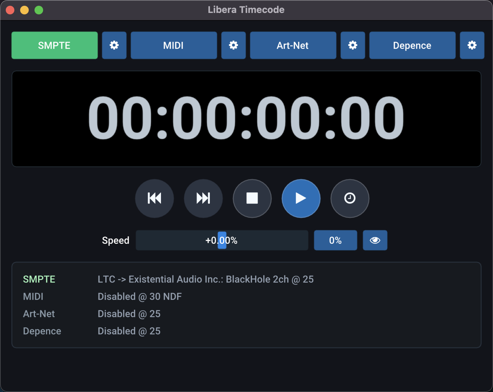

# Libera Timecode

Libera Timecode is a native timecode generator for show, media, and lighting
systems.

It generates:

- SMPTE LTC audio timecode
- MIDI Time Code, including quarter-frame and full-frame messages
- Art-Net ArtTimeCode over UDP
- SNTC over UDP

The app can run from an internal transport or send wall-clock time. Supported
frame rates include 23.976, 24, 25, 29.97 drop-frame, 29.97 non-drop-frame,
30 drop-frame, and 30 non-drop-frame.



## Using The App

Start Libera Timecode, choose the frame rate and output types you need, then
enable the relevant outputs. The main window provides transport controls,
varispeed playback, timecode readout, and per-output status.

The settings file is stored in the user's normal application config directory:

- macOS: `~/Library/Application Support/Libera Timecode`
- Linux: `$XDG_CONFIG_HOME/libera-timecode` or `~/.config/libera-timecode`
- Windows: the user's roaming app data directory

## Safety

Timecode can trigger real show equipment. Verify routing, frame rate, and output
destinations before connecting it to production systems.

## Building

The project uses CMake and vendored dependencies.

```bash
cmake --preset release
cmake --build --preset release --parallel
ctest --test-dir build --build-config Release --output-on-failure
```

Useful targets:

- `libera_timecode`: the GUI application
- `libera_timecode_jitter`: timing/jitter measurement harness
- `libera_timecode_tests`: protocol and timecode tests

## Release Builds

GitHub Actions builds macOS, Linux, and Windows artifacts. Pushes to `main`
produce packaged artifacts, and tags matching `v*` create a GitHub Release.

Download the latest packaged release from
[GitHub Releases](https://github.com/sebleedelisle/libera-timecode/releases).

See [CI and release](docs/ci-release.md).

## Licensing

Unless otherwise noted, project-authored files in this repository are licensed
under the GNU General Public License v3.0 (`LICENSE`).

Third-party code and assets keep their own upstream licenses; see
`LICENSING.md`.
